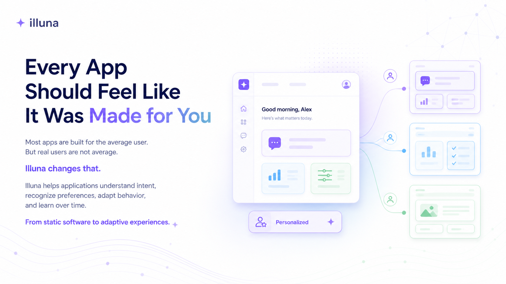

## Every App Should Feel Like It Was Made for You

Most applications are still built around a static idea of the user.

They offer the same interface, the same tone, the same workflows, and the same assumptions to everyone. Even when apps are useful, they often feel generic. They function — but they do not connect.

Illuna starts from a different belief:

> The next generation of applications will not only be functional.
> They will be adaptive, conversational, and personal.

We believe that software should be able to understand how people express intent, how they prefer to interact, and how their needs change over time.

Instead of forcing users into fixed forms, static menus, and predefined flows, applications should be able to listen, interpret, adapt, and evolve.

---

## The Problem

Today’s apps are mostly designed for the average user.

But real users are not average.

Some prefer direct language.
Some need guidance.
Some want a minimal interface.
Some want more context.
Some prefer playful interactions.
Some want professional, precise workflows.

Traditional applications rarely adapt to these differences in a meaningful way.

Personalization is often limited to settings, dashboards, themes, or recommendations. But the core experience usually stays the same.

The result is a gap between function and connection:

* Apps may solve a task, but still feel impersonal.
* Interfaces may be powerful, but hard to approach.
* Users may have feedback, but the app cannot truly react.
* Products may collect preferences, but rarely translate them into behavior.

Illuna exists to close this gap.

---

## Our Vision

We imagine a world where people interact with apps as naturally as they interact with another person.

A world where users can say:

* “Make this simpler.”
* “Explain it more clearly.”
* “Use a calmer tone.”
* “Show me only what matters.”
* “Adapt this to how I work.”
* “This feels too technical.”
* “Make the app feel more like me.”

And the application understands.

Not just as a command. Not just as a prompt. But as a signal for adaptation.

Illuna is a framework for applications that can:

* understand user intent,
* detect style and preference signals,
* adapt tone and interface behavior,
* personalize workflows,
* learn from repeated interaction,
* and evolve over time.

The goal is not to replace good product design.

The goal is to make product design responsive.

---

## What We Are Building

Illuna is an open concept and reference architecture for adaptive, AI-personalized applications.

It explores how modern apps can move from static user experience to dynamic, conversational experience.

At its core, Illuna connects four ideas:

### 1. Adaptive interaction, not chat-only

Developers should only need to provide the base application.

From there, Illuna should automatically tailor the user experience for each person — without requiring the developer to manually implement every variation, edge case, or personalization setting themselves.

This includes automatic adaptation of language, interface behavior, and accessibility preferences (for example larger text or clearer visual contrast).

At the same time, adaptation must stay inside developer-defined boundaries: teams decide what Illuna may change, how far it may go, and which areas remain fixed. Illuna should reduce implementation overhead — not remove product ownership.

Chat is one possible interface layer, but not the only one.

Depending on context and user preference, the experience can appear as chat-first, traditional UI-first, or a hybrid of both.


### 1.5 Bounded adaptation, not design replacement

Illuna is meant to support product teams — not replace UX designers, UI experts, or product thinking.

Design systems, navigation concepts, and core user journeys are still created by humans.

Illuna adds a configurable adaptation layer within those rules: for example tone, explanation depth, guidance intensity, content density, or visual emphasis.

Developers and designers can define clear limits (what is adaptable, what is locked, what needs explicit consent) so personalization stays safe, brand-consistent, and testable.

### 2. Intent understanding

User messages are interpreted into structured intent.

The system identifies what the user wants, what tone they use, what context matters, and whether the message contains personalization signals.

Example:

```json
{
  "intent": "preference_update",
  "entities": {
    "topic": "visual style",
    "language": "German"
  },
  "tone": "friendly",
  "context": "user interacting with an adaptive app",
  "confidence": 0.91
}
```

### 3. Adaptive experience

The application translates intent into changes.

These changes may affect:

* language,
* tone,
* layout,
* visual theme,
* content density,
* feature visibility,
* workflow guidance,
* or interaction style.

The app does not just answer. It adapts.

### 4. Continuous personalization

Every meaningful interaction can become a signal.

Over time, the app develops a better understanding of the user’s preferences and adapts with less friction.

Personalization should not feel like configuration. It should feel like the app is learning.

---

## Example: GardenMate

GardenMate is the first product example built around the Illuna idea.

It is a personal gardening companion that helps users plan, understand, and care for their garden.

But GardenMate is not only a gardening app.

It is a demonstration of the broader Illuna vision:

* the user talks to the app naturally,
* the app understands gardening intent,
* the app adapts tone and visual style,
* the experience becomes more personal over time.

If a user says:

> “Make the design brighter — it should feel more like a garden, maybe a bit animated.”

GardenMate should not treat this as random feedback.

It should understand it as a personalization request and adapt the experience accordingly.

This is the kind of interaction Illuna is designed to enable.

---


## Example Scenarios (expanded)

To make the Illuna value clearer for product teams, we now treat adaptive behavior as a cross-domain pattern, not a single app feature.

Representative scenarios include:

* **Garden planning assistant** (GardenMate): adapts guidance depth for beginners vs. advanced users.
* **Learning companion**: adjusts explanation pace, visual density, and quiz difficulty based on learner signals.
* **Health routine app**: changes tone and reminder strictness depending on motivation and stress context.
* **Finance dashboard**: can switch between concise “just decisions” mode and detailed “audit trail” mode.
* **Team productivity workspace**: adapts workflow guidance, summaries, and notification intensity by role and workload.

Across all examples, the core principle stays the same: users can describe *how* the app should behave, and the app translates this into bounded, reversible product changes.

---

## Implementation Example (product-level)

A practical implementation pattern is:

1. Start with a stable base UI and explicit adaptation targets.
2. Classify user messages into intent + preference signals.
3. Resolve context from app state, workflow state, and preference memory.
4. Generate a structured adaptation plan (not free-form UI mutation).
5. Apply only allowed changes, with undo and transparency events.
6. Persist accepted preferences and learn over repeated interactions.

This keeps Illuna implementation testable for engineering teams and understandable for users.

---

## What This Repository Contains

This repository documents the public concepts behind Illuna.

It includes:

* vision and principles,
* reference architecture,
* intent classification patterns,
* adaptive UI concepts,
* simplified examples,
* and experimental SDK interfaces.

The goal is to make the idea understandable, discussable, and extensible.

This repository is not the full production framework.

The proprietary Illuna Framework Core, production personalization logic, and advanced system prompts are not included here.

---

## What Illuna Is Not

Illuna is not just another chatbot wrapper.

It is not a no-code builder.

It is not a prompt collection.

It is not a generic AI assistant embedded into an app.

Illuna is about making the application itself adaptive.

If chat is present, it is only the beginning — the deeper value is system-level adaptation across the whole product experience.

The real value comes from translating user intent into product behavior.

---

## Design Principles

### Human-first

The system should adapt to the user, not the other way around.

### Transparent

Users should understand when and why the app changes.

### Useful before magical

Adaptation must create real value. A personalized app that only changes colors is not enough.

### Safe by design

Personalization must respect privacy, boundaries, and user control.

### Product-aware

AI should not randomly generate features or behavior. It should operate within clear product rules and design constraints.

### Developer-friendly

Adaptive behavior should be easy to integrate, test, and control.

Illuna should take over repetitive personalization plumbing, while keeping all critical constraints configurable by the product team.

---

## Long-Term Direction

The long-term goal of Illuna is to become a framework-as-a-service for adaptive applications.

Developers should be able to integrate Illuna into their products and enable:

* intent-aware interfaces,
* adaptive tone and design,
* personalized workflows,
* app-specific AI agents,
* user preference memory,
* and dynamic feature experiences.

The future of software is not only intelligent.

It is personal.

Illuna exists to help build that future.
