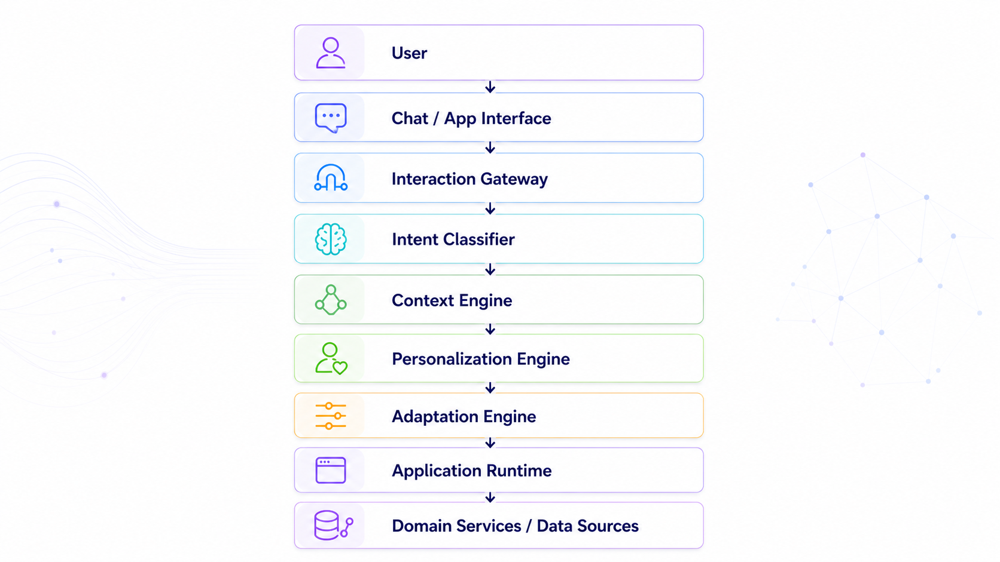
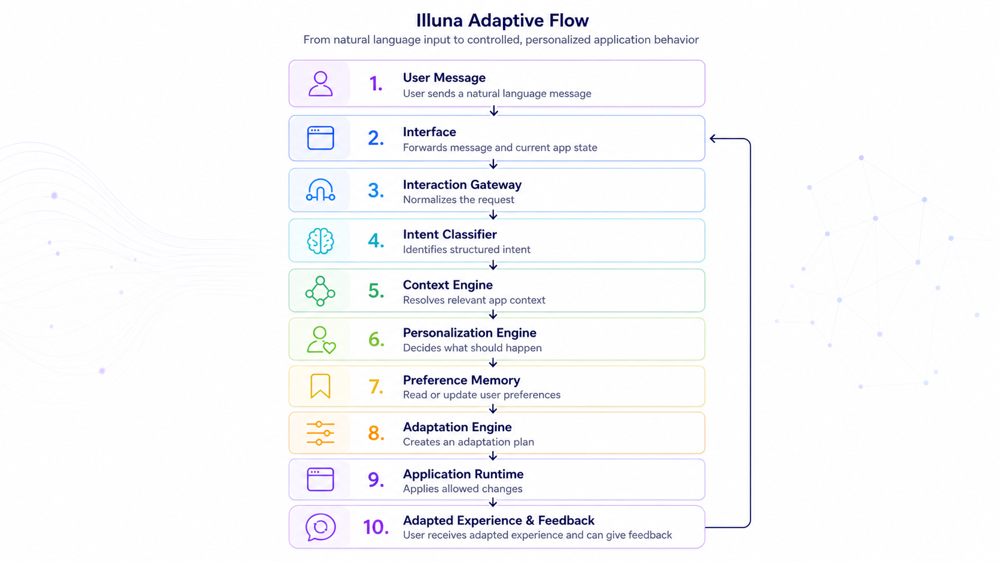

# 02 · Core Concepts

## From Static Apps to Adaptive Experiences

Most applications today are static by default.

They may offer settings, themes, filters, dashboards, or notifications — but the core experience usually remains the same for every user.

Illuna is based on a different model:

> Applications should be able to understand user intent, detect preference signals, and adapt their behavior over time.

An adaptive app is not only an app with AI inside.

It is an app where AI becomes part of the interaction model, personalization layer, and product logic.

---

## The Illuna Model

Illuna describes adaptive applications through a simple flow:



This flow turns natural language into structured product behavior.

The user does not need to configure the app manually. They can express what they want, how they feel, or how the app should behave — and the system translates this into controlled adaptation.

---


## Concept Architecture (visual)



The diagram summarizes the same flow: user message → intent understanding → context interpretation → personalization decision → app adaptation, with a feedback loop for continuous learning.

---

## 1. User Message

The user message is the starting point of every adaptive interaction.

It may contain:

* a direct request,
* a question,
* feedback,
* frustration,
* a preference,
* a design instruction,
* a workflow request,
* or a context update.

Examples:

```text
"Make this easier to understand."
```

```text
"I prefer a more professional tone."
```

```text
"Can you show me only the important tasks?"
```

```text
"This design feels too dark. Make it lighter and more natural."
```

In traditional apps, these messages are often ignored, treated as support input, or answered once.

In Illuna, they become product signals.

---

## 2. Intent Understanding

Intent understanding is the process of converting natural language into structured meaning.

The goal is not only to answer the user.

The goal is to understand what kind of product behavior should follow.

A simplified intent classification may look like this:

```json
{
  "intent": "preference_update",
  "entities": {
    "topic": "visual_style",
    "style": "bright, playful, spring-like",
    "language": "English"
  },
  "tone": "friendly",
  "context": "user wants visual personalization",
  "confidence": 0.93
}
```

Intent understanding helps the system decide whether the message is:

* a general question,
* a preference update,
* a design request,
* a feature request,
* a workflow instruction,
* a system-level action,
* or something that requires clarification.

This layer creates the bridge between language and application logic.

---

## 3. Context Interpretation

Intent alone is not enough.

The same message can mean different things depending on context.

For example:

```text
"Make it lighter."
```

This could refer to:

* visual theme,
* tone of voice,
* content density,
* task complexity,
* emotional mood,
* or computational workload.

Context interpretation combines the user message with relevant app state.

This may include:

* current screen,
* active workflow,
* previous user preferences,
* device type,
* accessibility settings,
* and recent interaction history.

Without context, adaptation can become noisy or incorrect.

---

## 4. Personalization Decision

After intent and context are understood, the system decides what to do.

The personalization layer determines whether to:

* adapt immediately,
* ask for clarification,
* store a preference,
* request confirmation,
* or respond without adaptation.

Example decision:

```json
{
  "adaptation_type": "visual_theme",
  "target": "theme_profile",
  "changes": {
    "color_palette": "light_natural",
    "animation_level": "medium",
    "mood": "spring"
  },
  "store_as_preference": true
}
```

This keeps adaptation predictable and policy-driven.

---

## 5. App Adaptation

The application translates the decision into concrete behavior.

The app may adapt:

* theme and color mood,
* layout density,
* tone and wording,
* feature visibility,
* workflow guidance,
* or content prioritization.

Example output:

```json
{
  "theme": {
    "background": "light",
    "primary_mood": "natural",
    "animation": "soft",
    "density": "comfortable"
  }
}
```

The result should feel intentional, understandable, and reversible.

---

## Core Principle

The most important idea behind Illuna is this:

> The user should not have to adapt to the app.
> The app should adapt to the user.

But adaptation must be structured.

It must be safe, explainable, reversible, and useful.

Illuna exists to explore exactly that balance.
